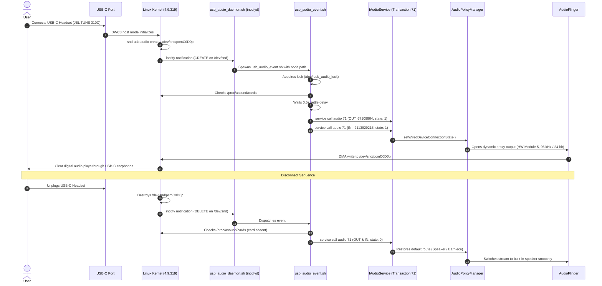

# Final Operational Path

This diagram illustrates the resolved event flow under the automated hotplug daemon.

```mermaid
sequenceDiagram
    autonumber
    actor User as User
    participant HW as USB-C Port
    participant Kernel as Linux Kernel (4.9.319)
    participant Daemon as usb_audio_daemon.sh (inotifyd)
    participant Handler as usb_audio_event.sh
    participant Binder as IAudioService (Transaction 71)
    participant APM as AudioPolicyManager
    participant AF as AudioFlinger

    User->>HW: Connects USB-C Headset (JBL TUNE 310C)
    HW->>Kernel: DWC3 host mode initializes
    Kernel->>Kernel: snd-usb-audio creates /dev/snd/pcmC0D0p
    Kernel->>Daemon: inotify notification (CREATE on /dev/snd)
    Daemon->>Handler: Spawns usb_audio_event.sh with node path
    Handler->>Handler: Acquires lock (/dev/.usb_audio_lock)
    Handler->>Kernel: Checks /proc/asound/cards
    Handler->>Handler: Waits 0.5s settle delay
    Handler->>Binder: service call audio 71 (OUT: 67108864, state: 1)
    Handler->>Binder: service call audio 71 (IN: -2113929216, state: 1)
    Binder->>APM: setWiredDeviceConnectionState()
    APM->>AF: Opens dynamic proxy output (HW Module 5, 96 kHz / 24-bit)
    AF->>Kernel: DMA write to /dev/snd/pcmC0D0p
    Kernel->>User: Clear digital audio plays through USB-C earphones

    Note over User,AF: Disconnect Sequence
    User->>HW: Unplugs USB-C Headset
    Kernel->>Kernel: Destroys /dev/snd/pcmC0D0p
    Kernel->>Daemon: inotify notification (DELETE on /dev/snd)
    Daemon->>Handler: Dispatches event
    Handler->>Kernel: Checks /proc/asound/cards (card absent)
    Handler->>Binder: service call audio 71 (OUT & IN, state: 0)
    Binder->>APM: Restores default route (Speaker / Earpiece)
    APM->>AF: Switches stream to built-in speaker smoothly
```

